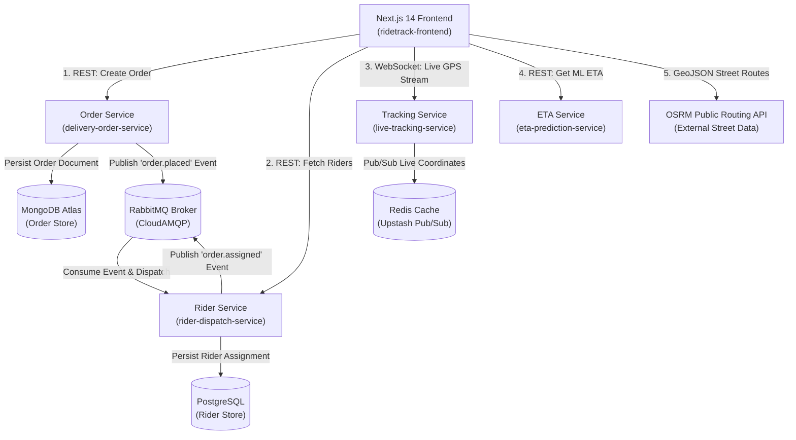

<div align="center">

# 🚴 RideTrack

**Event-Driven Microservices Platform for Real-Time Delivery Tracking & Automated Rider Dispatch**

[](https://github.com/aashbirsingh25/ridetrack/actions/workflows/ci.yml)
[](https://opensource.org/licenses/MIT)
[](https://github.com/aashbirsingh25/ridetrack/commits/main)
[](https://github.com/aashbirsingh25/ridetrack)

---

### 🌐 [Live Interactive Demo](https://ridetrack-q1ta.vercel.app) &nbsp;|&nbsp; 🐙 [GitHub Repository](https://github.com/aashbirsingh25/ridetrack)

---

### 🛠️ Tech Stack


</div>

<br />

## 📌 Overview

**RideTrack** solves the core engineering challenges behind modern logistics platforms like Uber Eats, DoorDash, and Amazon Prime Now: **instant order placement, event-driven driver dispatch, live sub-second GPS tracking, and machine-learning powered ETA predictions**.

### Why Microservices over a Monolith?

Rather than coupling all capabilities into a single monolithic codebase, RideTrack uses a distributed microservice architecture designed for scale, resilience, and operational clarity:

* **Targeted Scaling**: The `live-tracking-service` handles thousands of concurrent WebSocket persistent connections and high-frequency Redis Pub/Sub messages without straining core REST APIs or database connection pools.
* **Polyglot & Domain-Optimized Tech Stacks**: Machine learning model inference and data preprocessing run in Python (`FastAPI`), while core business services run on `NestJS` for strong TypeScript domain typing and enterprise application architecture.
* **Fault Isolation**: A failure in external routing calls (e.g., OSRM) or ETA predictions degrades gracefully without crashing order creation or rider management APIs.
* **Asynchronous Decoupling**: Order creation and rider dispatching are decoupled using `RabbitMQ` message queues, ensuring sub-millisecond API response times for customers during peak demand spikes.

---

## 🌟 Highlights

| Feature | Tech / Engine | Architectural Impact |
| :--- | :--- | :--- |
| **Event-Driven Auto-Dispatch** | RabbitMQ (AMQP) | Asynchronously broadcasts `order.placed` events to match nearest riders instantly without blocking order ingestion. |
| **Live GPS Tracking** | WebSockets (Socket.io) + Redis Pub/Sub | Streams real-time rider coordinates to clients with sub-second latency and zero UI lag. |
| **Road-Following Navigation** | OSRM Public Routing API | Snaps origin and destination points to actual street geometry instead of inaccurate straight lines. |
| **ML ETA Prediction** | Python + FastAPI + Scikit-Learn | Random Forest model trained on trip metrics achieving **MAE of 1.52 minutes** and **R² of 0.99**. |
| **Geospatial Rider Matching** | PostgreSQL Spatial Queries | Queries active riders in geographic proximity to pick up new assignments efficiently. |
| **One-Command Orchestration** | Docker Compose | Spins up all 5 microservices, databases, and message brokers locally with `docker compose up --build -d`. |
| **Automated Green CI** | GitHub Actions Workflow | Runs end-to-end linting, unit testing, and Docker build validations on every pull request and push. |
| **Proactive Security Hardening** | Git History Purge & Secret Rotation | Handled credential exposure via `git-filter-repo`, full secret rotation, and strict `.env` policy enforcement. |

---

## 🏗️ Architecture & Event Flow



---

## 🛠️ Service Breakdown

| Service | Tech Stack | Port | Primary Responsibility |
| :--- | :--- | :--- | :--- |
| **`ridetrack-frontend`** | Next.js 14, React 18, Tailwind CSS, Leaflet | `3003` | User order interface, live driver map tracking, route rendering, and rider dashboard. |
| **`delivery-order-service`** | NestJS, TypeScript, Mongoose | `3000` | Order lifecycle state machine, order creation REST API, and MongoDB persistence. |
| **`rider-dispatch-service`** | NestJS, TypeScript, TypeORM | `3001` | Rider registration, availability states, geospatial proximity matching, and PostgreSQL storage. |
| **`live-tracking-service`** | NestJS, TypeScript, Socket.io | `3002` | High-frequency bidirectional WebSocket rooms and Redis Pub/Sub location caching. |
---

## 🌍 Live Deployment

This project is deployed in two parallel setups to demonstrate different deployment strategies:

> Both deployments run the same codebase. The AWS EC2 setup demonstrates hands-on infrastructure management (Docker, Linux server administration, memory-constrained optimization). The Render/Vercel setup demonstrates modern managed PaaS deployment practices.

### 1. AWS EC2 (Self-managed, Docker Compose)
- **Live URL:** http://13.51.255.63:3003

| Service | Live Endpoint |
|---|---|
| Frontend App | http://13.51.255.63:3003 |
| Order Service REST API | http://13.51.255.63:3000 |
| Rider Dispatch Service REST API | http://13.51.255.63:3001 |
| Live Tracking Service (REST & WebSockets) | http://13.51.255.63:3002 |
| ETA Prediction API | http://13.51.255.63:3004/health |

- **Setup:** All 5 microservices (`delivery-order-service`, `rider-dispatch-service`, `live-tracking-service`, `eta-prediction-service`, `ridetrack-frontend`) containerized with Docker Compose on a single AWS EC2 instance (t3.micro, Ubuntu 24.04).
- **Key engineering notes:**
  - Initial deployment attempt on t3.micro (1GB RAM) hit repeated out-of-memory crashes when building all 5 services in parallel via `docker compose up -d --build`.
  - Resolved by upgrading temporarily to t3.small (2GB RAM) to complete the build, building services sequentially instead of in parallel, and adding a 2GB swap file for memory headroom.
  - Downsized back to t3.micro (free tier) post-deployment to keep infrastructure cost at zero, without needing a rebuild of the backend services.
  - Frontend environment variables (`NEXT_PUBLIC_*`) are baked in at Next.js build time, so any change to the EC2 public IP requires a full frontend rebuild — documented as a known operational step.
- ⚠️ Note: Instance does not currently have an Elastic IP attached, so the public IP may change if the instance is restarted.

### 2. Render (backends) + Vercel (frontend)
- **Setup:** Managed, zero-maintenance PaaS deployment — no manual server administration, auto-deploys on push to `main`.

| Service | Live Endpoint |
|---|---|
| Frontend (Vercel) | https://ridetrack-q1ta.vercel.app |
| Order Service (Render) | https://delivery-order-service.onrender.com |
| Rider Dispatch Service (Render) | https://rider-dispatch-service.onrender.com |
| Live Tracking Service (Render) | https://live-tracking-service.onrender.com |
| ETA Prediction Service (Render) | https://eta-prediction-service.onrender.com |

⚠️ Render free-tier backend services spin down after ~15 minutes of inactivity and may take 30-60s to respond on first request (cold start).

---

## 🚀 Local Setup Instructions

### 1. Prerequisites
* [Docker Desktop](https://www.docker.com/products/docker-desktop/) with Docker Compose v2+ installed.
* [Git](https://git-scm.com/) installed.

### 2. Quick Start (Docker Compose)

1. **Clone the repository**:
   ```bash
   git clone https://github.com/aashbirsingh25/ridetrack.git
   cd ridetrack
   ```

2. **Configure Environment Variables**:
   Copy `.env.example` templates in each service directory (or use default container configs provided in `docker-compose.yml`).

3. **Spin Up Containers**:
   ```bash
   docker compose up --build -d
   ```

### 3. Local Service Endpoints

| Service / Component | Local URL |
| :--- | :--- |
| **Frontend Web Application** | [http://localhost:3003](http://localhost:3003) |
| **Order Service REST API** | [http://localhost:3000](http://localhost:3000) |
| **Rider Dispatch Service REST API** | [http://localhost:3001](http://localhost:3001) |
| **Live Tracking Service (WebSockets)** | [http://localhost:3002](http://localhost:3002) |
| **ETA Prediction Service Docs / Health** | [http://localhost:3004/health](http://localhost:3004/health) |

---

## 📁 Project Folder Structure

```text
ridetrack/
├── .github/
│   └── workflows/
│       └── ci.yml                   # Automated CI pipeline workflow
├── delivery-order-service/           # NestJS Order Lifecycle Microservice
│   ├── src/                         # Controllers, Services, Schemas
│   ├── Dockerfile
│   └── package.json
├── rider-dispatch-service/          # NestJS Rider Management & Dispatch Service
│   ├── src/                         # Dispatch logic, Entities, Handlers
│   ├── Dockerfile
│   └── package.json
├── live-tracking-service/           # NestJS WebSocket Location Streaming Service
│   ├── src/                         # Socket Gateway, Redis Adapter
│   ├── Dockerfile
│   └── package.json
├── eta-prediction-service/          # Python FastAPI Machine Learning Microservice
│   ├── model/                       # Data generator, Model trainer, Serialized model (.pkl)
│   ├── main.py                      # FastAPI endpoint definition
│   ├── Dockerfile
│   └── requirements.txt
├── ridetrack-frontend/              # Next.js 14 Interactive Web Dashboard
│   ├── src/                         # React components, Map view, Socket client
│   ├── Dockerfile
│   └── package.json
├── DEPLOYMENT.md                    # Cloud deployment guide (Render + Vercel)
├── docker-compose.yml               # Local orchestration for all 5 services
└── README.md                        # Project documentation
```

---

## 🧠 Engineering Notes & Lessons Learned

### 1. Fixing NestJS Circular Dependency Injection
During initial service modularization, a circular dependency error was encountered between the Order Management Module and Dispatch Notification Handlers (each importing services/tokens from one another). 
* **Solution**: Refactored module imports using NestJS `forwardRef()` utility and clean event abstraction via RabbitMQ handlers, completely decoupling compile-time token resolution while retaining full runtime type-safety.

### 2. Security Secret Exposure Incident & Remediation
A MongoDB connection string was inadvertently committed during early development and flagged by GitHub Secret Scanning.
* **Immediate Response**: Rotated the exposed database credentials immediately on MongoDB Atlas.
* **Remediation**: Used `git-filter-repo` to purge the exposed credential string from the full Git commit history.
* **Hardening**: Standardized `.env.example` templates, added secret scanning hooks, and proactively rotated credentials across all other service datastores (Supabase PostgreSQL, Upstash Redis, and CloudAMQP RabbitMQ) to enforce robust security hygiene.

### 3. Resolving Live-Marker Flickering in Leaflet Maps
During high-frequency (500ms) WebSocket position updates, map marker pins experienced erratic flickering and layout jumps. Thorough debugging revealed **three combined root causes**:
1. **Unstable Component Keys**: Dynamic keys generated on each render forced React to destroy and recreate DOM Leaflet instances.
2. **CSS Transform Conflicts**: Leaflet's internal translation transforms conflicted with CSS transition rules applied to map container elements.
3. **Unmemoized Parent Props**: Parent component state changes triggered unneeded re-renders of map children.
* **Fix**: Implemented direct, imperative Leaflet marker coordinate updates (`markerRef.current.setLatLng()`), stabilized component keys, and wrapped map views in `React.memo` and `useMemo` hooks.

---

## 🔮 Roadmap

- [ ] **Kubernetes Orchestration**: Production deployment configs and Helm charts for minikube / EKS.
- [ ] **Observability & Monitoring**: Prometheus metric collection and Grafana dashboards for throughput and WebSocket latency.
- [ ] **Live Traffic ETA Recalculation**: Continuous ETA adjustments based on dynamic congestion along active routes.
- [ ] **Multi-Rider Bidding Flow**: Auction-style dispatching allowing nearby drivers to accept or bid on delivery offers.

---

## 📜 License

Distributed under the **MIT License**. See `LICENSE` for details.
