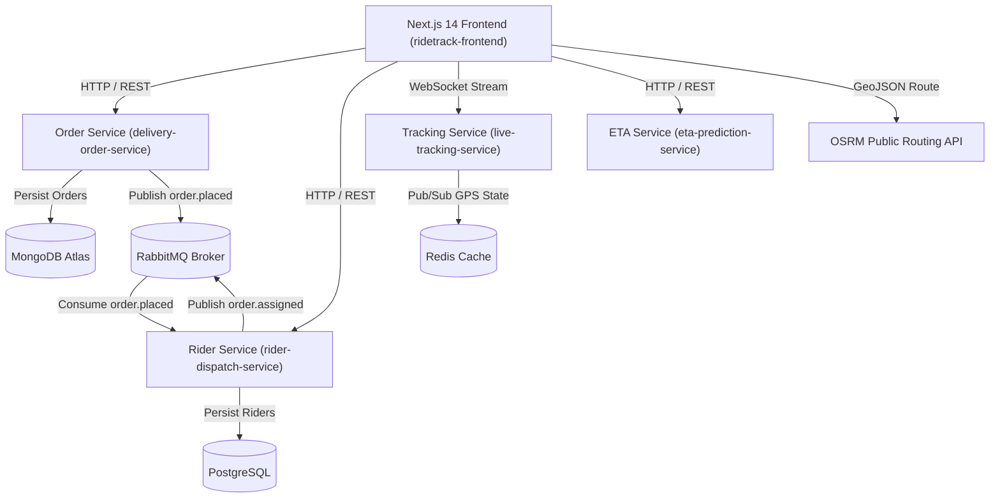

# RideTrack 🚴📦

[](https://github.com/aashbirsingh25/ridetrack/actions/workflows/ci.yml)

🚀 **Live Frontend Demo**: [https://ridetrack-q1ta.vercel.app](https://ridetrack-q1ta.vercel.app) *(Note: Backend microservices deployed on Render)*

RideTrack is a real-time delivery tracking and logistics platform architected with an event-driven microservices infrastructure. Built to demonstrate distributed systems design, RideTrack orchestrates asynchronous order dispatching via message queues, real-time bidirectional GPS location streaming over WebSockets, machine learning-driven ETA duration predictions, and interactive road-following map navigation.

---

## ✨ Key Features

- ⚡ **Real-Time GPS Tracking**: Bidirectional WebSocket stream (`Socket.io`) backed by Redis pub/sub caching for smooth, flicker-free live location updates on Leaflet maps.
- 🔄 **Event-Driven Auto-Dispatch**: Asynchronous message broker pipeline via `RabbitMQ` that decouples order intake from nearest-rider matching algorithms.
- ⏱️ **ML-Based ETA Prediction**: Dedicated Python FastAPI microservice utilizing `scikit-learn` Random Forest regression to predict delivery duration based on trip distance and time-of-day traffic patterns.
- 📍 **Geospatial Rider Matching**: Haversine distance calculations and PostgreSQL queries to match incoming orders with the nearest available rider.
- 🗺️ **Road-Following Route Geometry**: Integrates the free OSRM Public Routing API to parse GeoJSON street coordinates and draw real road paths instead of straight lines.

---

## 📐 Architecture & Event Flow



---

## 🛠️ Tech Stack & Service Breakdown

| Service / Component | Technology Stack | Database / Broker | Primary Role |
| :--- | :--- | :--- | :--- |
| **`ridetrack-frontend`** | Next.js 14, React 18, Tailwind CSS, Leaflet | LocalSockets / State | Interactive order placement, live GPS map tracking, and rider dashboard controls. |
| **`delivery-order-service`** | NestJS, TypeScript, Mongoose | MongoDB Atlas | Order lifecycle management, status transitions, and order creation events. |
| **`rider-dispatch-service`** | NestJS, TypeScript, TypeORM | PostgreSQL (Supabase) | Rider profile registry, availability management, and geospatial proximity dispatching. |
| **`live-tracking-service`** | NestJS, TypeScript, Socket.io | Upstash Redis | Bidirectional WebSocket rooms streaming real-time rider GPS coordinate updates. |
| **`eta-prediction-service`** | Python 3.11, FastAPI, Scikit-learn | Serialized ML Model (`eta_model.pkl`) | Machine learning regression predicting trip delivery duration in minutes. |
| **Message Broker** | AMQP (CloudAMQP) | RabbitMQ | Asynchronous event bus connecting Order Placement and Rider Dispatch microservices. |

---

## 🚀 Local Setup Instructions

### 1. Prerequisites
- [Docker Desktop](https://www.docker.com/products/docker-desktop/) with Docker Compose v2+

### 2. Quick Start (Docker Compose)
Clone the repository and run all 5 microservices in detached mode:

```bash
git clone https://github.com/aashbirsingh25/ridetrack.git
cd ridetrack

# Build and start all microservices
docker compose up --build -d
```

### 3. Service Endpoint Access

| Service | Local URL |
| :--- | :--- |
| **Frontend Web App** | `http://localhost:3003` |
| **Order Service REST API** | `http://localhost:3000` |
| **Rider Dispatch Service REST API** | `http://localhost:3001` |
| **Live Tracking Service (WebSockets)** | `http://localhost:3002` |
| **ETA Prediction Service Docs** | `http://localhost:3004/health` |

---

## 📊 Useful Docker Commands

```bash
# View status of running containers
docker compose ps

# Stream logs across all services
docker compose logs -f

# Stop all services
docker compose down
```
